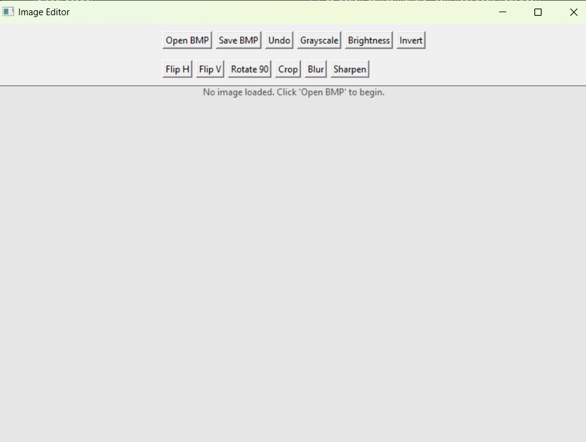
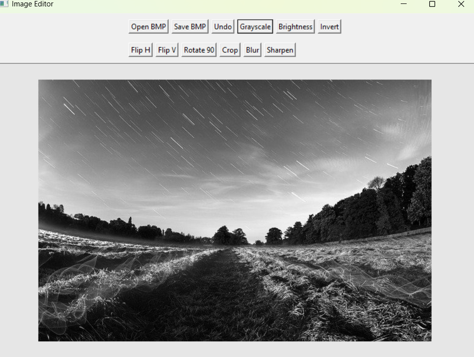
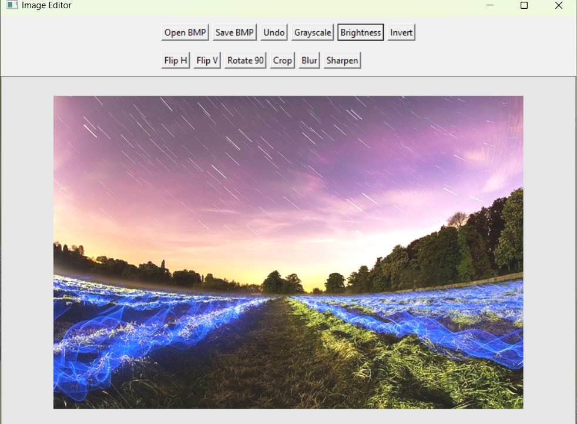
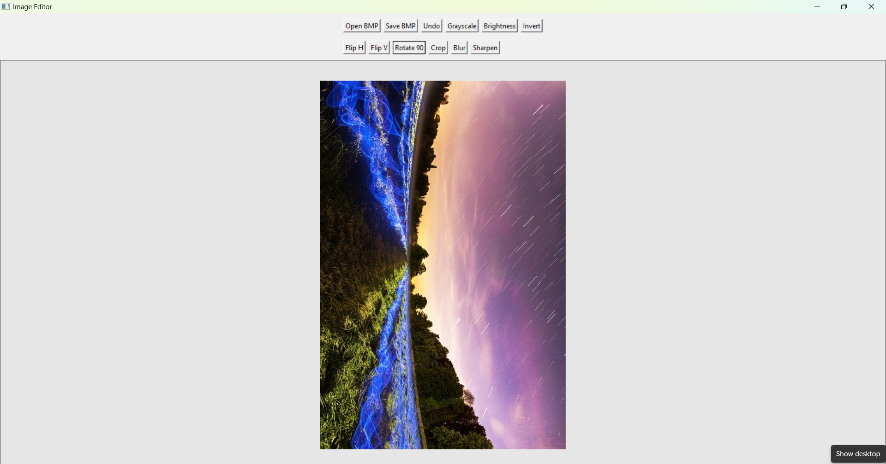
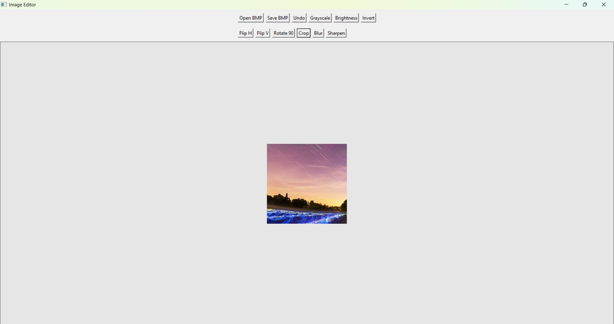
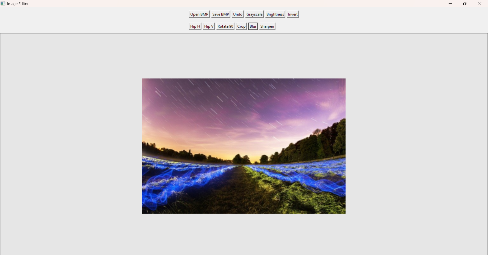
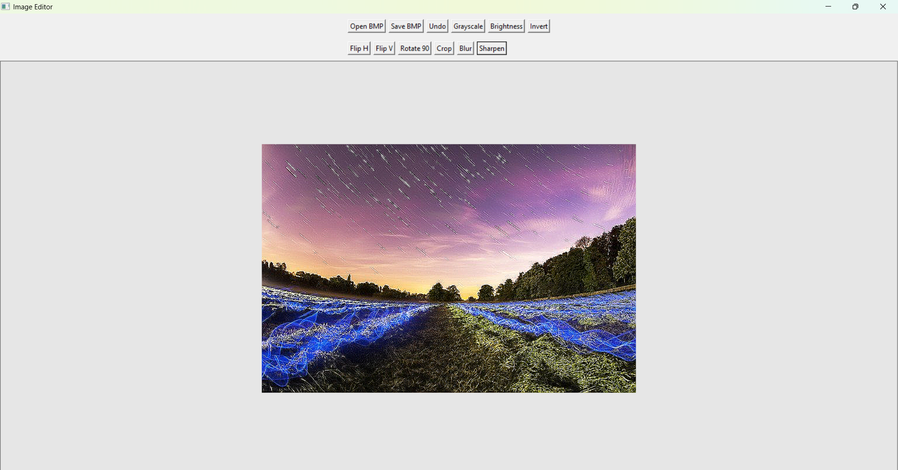
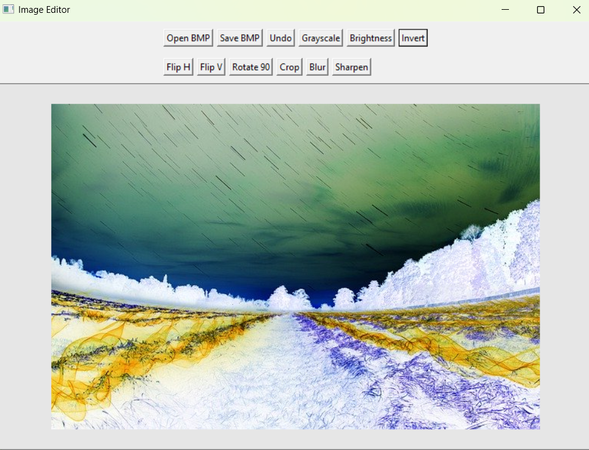
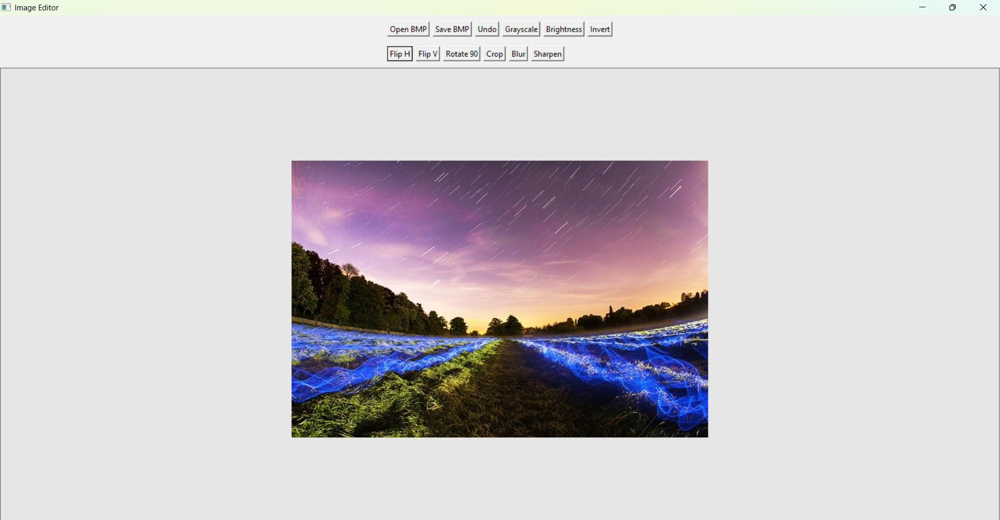
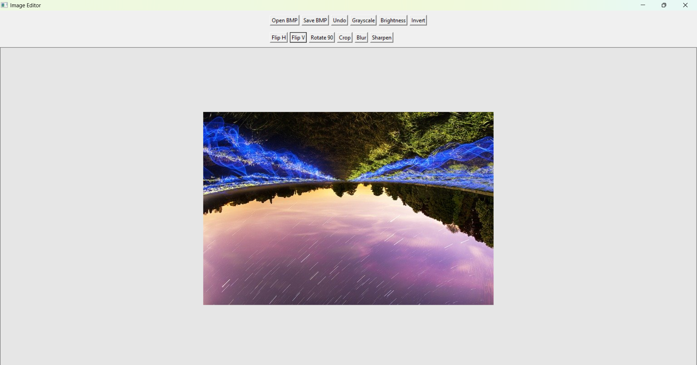

## Image Editor

## Project Description
This project is a graphical image editor developed in C using the IUP toolkit. The application allows the user to open and display 24-bit uncompressed BMP images, apply different image manipulation operations, and save the modified image.

## Features
- Open 24-bit uncompressed BMP images
- Display images
- Save images as BMP files
- Grayscale conversion
- Brightness adjustment
- Image inversion
- Horizontal flip
- Vertical flip
- 90-degree rotation
- Image cropping
- Blur
- Undo
- Image sharpening

## Project Structure
ImageEditor/
├── main.c
├── image.c
├── image.h
├── processing.c
└── processing.h
# main.c
Contains the IUP graphical user interface, buttons, dialogs, and callback functions.

# image.c / image.h
Handle image structures, memory allocation, BMP loading, BMP saving, and image copying/freeing.

# processing.c / processing.h
Contain the image manipulation algorithms and their function declarations.

# Image Representation
Each pixel is represented using red, green, and blue components. The complete image is represented using its width, height, and a dynamically allocated array of pixels.

# Image Processing
The image manipulation algorithms were implemented directly in C. The project uses pixel-level operations for grayscale conversion, brightness adjustment, inversion, flipping, rotation, cropping, blur, and sharpening.

## Screenshots
Main Interface

Grayscale

Brightness Adjustment

Rotation

Cropping

Blur

Sharpen

Invert

Horizontal Flip

Vertical Flip

## Technologies Used
- C
- IUP (Portable User Interface)
- BMP image format
- Structures
- Pointers
- Dynamic memory allocation
- Arrays
- Modular programming

## Author
Juairia Shafique
